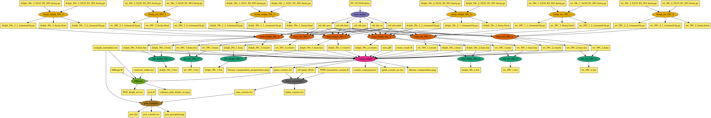

# RNA-Seq Pegasus Workflow

Bacterial RNA-Seq analysis workflow for [Pegasus WMS](https://pegasus.isi.edu/), converted from the [chienlab-rnaseq](https://github.com/ChienLab/chienlab-rnaseq) Nextflow DSL2 pipeline.

## Pipeline Overview

```
Sample FASTQ files
    │
    ▼
┌─────────┐   per-sample
│  FASTP   │   (parallel)    QC + adapter trimming
└────┬─────┘
     │
     ▼
┌──────────┐                 ┌───────────┐
│ BWA_ALIGN │◄───────────────│ BWA_INDEX  │  Build reference index
└────┬──┬───┘                └───────────┘
     │  │
     │  └──────────┐
     ▼             ▼
┌───────────┐  ┌──────────┐
│ BAM2BIGWIG│  │COUNT_READS│  Fan-in: all BAMs → gene counts
└───────────┘  └────┬──────┘
                    │
                    ▼
              ┌──────────────┐
              │TMM_NORMALISE │  edgeR TMM normalization
              └──────┬───────┘
                     │
            ┌────────┴────────┐
            ▼                 ▼
      ┌───────────┐    ┌────────────┐
      │    PCA    │    │ DIFF_EXPR  │  (optional, DESeq2)
      └───────────┘    └────────────┘
```
### DAG Visualization

The following diagram shows the workflow DAG:



## Prerequisites

- [Pegasus WMS](https://pegasus.isi.edu/) >= 5.0
- [HTCondor](https://htcondor.org/) (for distributed execution)
- Apptainer (on the submit host to build, and on the worker nodes to run)

## Container

Build the container with all required tools:

```bash
apptainer build Apptainer/RNASeq_Container.sif Apptainer/RNASeq_Container.def

# Verify
apptainer exec Apptainer/RNASeq_Container.sif which bwa samtools fastp Rscript
```

No registry push — Pegasus stages the `.sif` like any other input file, and
`workflow_generator.py` looks for `Apptainer/RNASeq_Container.sif` by default
(override with `--container-sif`).

Apptainer cannot build on macOS, and a `.sif` is single-architecture — build on a
Linux host matching your worker nodes. Note that the single micromamba solve
pulling the whole R/Bioconductor stack is slow and unreliable under qemu
emulation, so build natively. See [`APPTAINER.md`](APPTAINER.md). The
legacy `Dockerfile` is kept as a fallback.

<details>
<summary>Optional: publish the image to ghcr.io</summary>

Useful for sharing one build across a team or citing an immutable artifact. Needs a
GitHub token with `write:packages`.

```bash
echo "$GHCR_TOKEN" | apptainer registry login --username <github-user> \
    --password-stdin oras://ghcr.io

TAG=$(git rev-parse --short HEAD)
apptainer push Apptainer/RNASeq_Container.sif \
    oras://ghcr.io/kthare10/rnaseq-workflow:$TAG

# On the submit host, pull back to the path the generator expects
apptainer pull Apptainer/RNASeq_Container.sif \
    oras://ghcr.io/kthare10/rnaseq-workflow:$TAG
```

Do **not** put the `oras://` URL in the transformation catalog — Pegasus supports
`docker://`, `shub://`, `library://`, `shifter://` and `file://`, not `oras://`.
Treat ghcr.io as a distribution channel and keep staging the local `.sif`. Details in
[`APPTAINER.md`](APPTAINER.md).

</details>

## Usage

### Basic (no differential expression)

```bash
./workflow_generator.py \
    --sample-file samples.tsv \
    --ref-genome references/genome.fasta \
    --ref-ann references/genome.gff \
    --data-dir /path/to/fastq/ \
    --output workflow.yml
```

### With differential expression

```bash
./workflow_generator.py \
    --sample-file samples.tsv \
    --ref-genome references/genome.fasta \
    --ref-ann references/genome.gff \
    --data-dir /path/to/fastq/ \
    --contrast-table contrasts.tsv \
    --p-thresh 0.05 \
    --l2fc-thresh 1.0 \
    --output workflow.yml
```

### Submit to Pegasus

```bash
pegasus-plan --submit -s condorpool -o local workflow.yml
pegasus-status <run-directory>
```

## Input Files

### Sample file (`--sample-file`)

Tab-separated file with columns:

| Column | Description |
|--------|-------------|
| sample | Sample identifier (used in output filenames) |
| file1 | Read 1 FASTQ filename |
| file2 | Read 2 FASTQ filename (empty for single-end) |
| group | Experimental group/condition |
| rep_no | Replicate number |
| paired | 1 for paired-end, 0 for single-end |
| strandedness | unstranded, forward, or reverse |

Example:

```tsv
sample	file1	file2	group	rep_no	paired	strandedness
WT_1	WT_1_R1.fq.gz	WT_1_R2.fq.gz	WT	1	1	reverse
WT_2	WT_2_R1.fq.gz	WT_2_R2.fq.gz	WT	2	1	reverse
KO_1	KO_1_R1.fq.gz	KO_1_R2.fq.gz	KO	1	1	reverse
KO_2	KO_2_R1.fq.gz	KO_2_R2.fq.gz	KO	2	1	reverse
```

### Contrast table (`--contrast-table`, optional)

Tab-separated file defining pairwise comparisons for DESeq2:

```tsv
group1	group2
KO	WT
```

### Reference files

- `--ref-genome`: Reference genome FASTA file
- `--ref-ann`: Reference genome GFF annotation file

## Output Files

| Directory/File | Description |
|----------------|-------------|
| `*_fastp.html` | Per-sample fastp QC reports |
| `*.bam` / `*.bam.bai` | Per-sample sorted alignments |
| `*.bw` | Per-sample BigWig files for genome browser |
| `gene_counts.tsv` | Raw gene-level read counts |
| `gene_counts_pc.tsv` | Protein-coding gene counts only |
| `counts_summary.tsv` | Per-sample library composition |
| `library_composition*.png` | Library composition plots |
| `cpm_counts.tsv` | TMM-normalized CPM values (log-transformed) |
| `rpkm_counts.tsv` | TMM-normalized RPKM values (log-transformed) |
| `pca_grouped.png` | PCA plot colored by group |
| `pca_coords.tsv` | PCA coordinates |
| `DGE_*.tsv` | Differential expression results per contrast |
| `volcano_plot_*.png` | Volcano plots per contrast |

## Project Structure

```
rnaseq-workflow/
├── workflow_generator.py          # Generates Pegasus catalogs + DAG
├── bin/
│   ├── fastp.py                   # Wrapper: QC and trimming
│   ├── bwa_index.py               # Wrapper: BWA index construction
│   ├── bwa_align.py               # Wrapper: BWA-MEM alignment
│   ├── bam2bigwig.py              # Wrapper: BAM → BigWig conversion
│   ├── count_reads.py             # Wrapper: calls count_reads.R
│   ├── tmm_normalise.py           # Wrapper: calls TMM_normalise_counts.R
│   ├── pca.py                     # Wrapper: calls pca.R
│   ├── diffexpr.py                # Wrapper: calls diffexpr.R
│   ├── count_reads.R              # R script: Rsubread featureCounts
│   ├── TMM_normalise_counts.R     # R script: edgeR TMM normalization
│   ├── pca.R                      # R script: PCA analysis
│   └── diffexpr.R                 # R script: DESeq2 + volcano plots
├── Apptainer/
│   └── RNASeq_Container.def       # Container definition with all tools
├── Dockerfile                     # Legacy Dockerfile, kept as a fallback
└── README.md
```

## Nextflow → Pegasus Conversion Notes

| Nextflow Concept | Pegasus Equivalent |
|------------------|-------------------|
| `process FASTP { ... }` | `Transformation("fastp")` + `bin/fastp.py` wrapper |
| `tuple val(meta), path(reads)` | Per-sample `Job` with explicit file inputs |
| Channel `.collect()` → fan-in | Multiple `File` objects as job inputs |
| `params.cont_tabl` conditional | `--contrast-table` CLI arg, conditional DAG |
| `conda "bioconda::fastp"` | Single Apptainer definition with all tools |
| `label 'process_high'` | `.add_pegasus_profile(memory="46 GB", cores=8)` |
| `publishDir` | `stage_out=True` on output files |
| Channel operations | Python loops in `create_workflow()` |
| `infer_dependencies=True` | Pegasus builds DAG from shared `File` objects |
